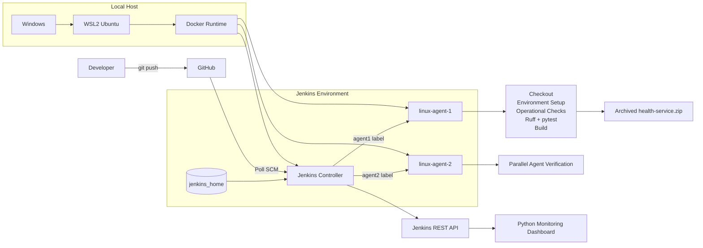

# Jenkins CI Reliability Lab

A hands-on Jenkins CI environment built to explore how continuous integration behaves under real operational conditions: distributed execution, limited capacity, infrastructure failures, unreliable tests, monitoring, credential handling and recovery.

The lab runs a Jenkins controller and two inbound Jenkins agents in Docker from a WSL2 Ubuntu environment. A declarative Jenkins pipeline validates a small Python application while reliability experiments deliberately exercise agent outages, queue pressure, environment failures, flaky tests and infrastructure problems.

## Portfolio Summary

This project demonstrates practical junior-level DevOps and platform-engineering skills through a working Jenkins environment rather than configuration examples alone.

It includes:

- Dockerized Jenkins controller with persistent storage
- two Docker-based Jenkins inbound agents
- distributed and parallel pipeline execution
- Pipeline from SCM with GitHub
- Poll SCM automation
- Python CI with pytest and Ruff
- build parameters and environment validation
- pipeline timeout and retention controls
- archived and fingerprinted build artifacts
- infrastructure retry handling
- CI failure classification
- executor and queue-capacity experiments
- Jenkins REST API monitoring
- Jenkins Credential Store integration
- API-token authentication
- operational troubleshooting and incident documentation

The focus is CI reliability and operability rather than production deployment.

## Why I Built This

A basic Jenkins pipeline can run tests successfully while still being difficult to operate when something goes wrong.

I built this lab to understand questions such as:

- What happens when an agent disappears?
- Why does a build stay in the queue?
- What changes when a node has one executor versus several?
- When is retrying a failed step appropriate?
- How can CI distinguish a product defect from an infrastructure problem?
- How should credentials reach a pipeline without entering source control?
- What Jenkins state should survive container recreation?
- What operational signals are useful when diagnosing CI failures?

The project evolved from a simple Jenkins installation into a small reliability lab for answering those questions experimentally.

## Architecture



The Jenkins controller coordinates scheduling, job configuration, credentials and build history.

Normal build work is delegated to containerized agents.

Jenkins state is stored in the persistent `jenkins_home` Docker volume so the controller container can be recreated without losing configuration.

Both agents and the controller communicate across the `jenkins-lab` Docker network.

More detail: [`docs/architecture.md`](docs/architecture.md)

## Repository Structure

```text
.
├── app/
│   ├── __init__.py
│   └── health.py
├── tests/
│   └── test_health.py
├── scripts/
│   ├── check_disk.sh
│   └── check_jenkins.py
├── monitoring/
│   └── dashboard.py
├── docker/
│   └── agent/
│       └── Dockerfile
├── docs/
│   ├── architecture.md
│   ├── incident-runbook.md
│   ├── jenkins-admin.md
│   ├── lessons-learned.md
│   ├── pipeline-design.md
│   └── troubleshooting.md
├── Jenkinsfile
├── Jenkinsfile.capacity
├── requirements.txt
├── .gitignore
└── README.md
```

## CI Workflow

The main job uses Pipeline from SCM and polls the GitHub repository:

```text
H/2 * * * *
```

The current workflow is:

```text
GitHub change
    ↓
Jenkins detects SCM revision
    ↓
Verify both Jenkins agents in parallel
    ↓
Checkout
    ↓
Create Python virtual environment
    ↓
Install pinned dependencies
    ↓
Validate pipeline environment
    ↓
Validate Jenkins credentials
    ↓
Operational checks
    ├── disk capacity
    └── Jenkins reachability with retry
    ↓
Quality checks in parallel
    ├── Ruff
    └── pytest
    ↓
Build ZIP artifact
    ↓
Archive + fingerprint artifact
```

The pipeline uses `agent none` at the top level and selects agents explicitly for stages requiring execution capacity.

See [`Jenkinsfile`](Jenkinsfile) and [`docs/pipeline-design.md`](docs/pipeline-design.md).

## Reliability Engineering

Reliability controls implemented in the lab include:

### Pipeline timeout

The pipeline is bounded by a ten-minute timeout so a blocked build cannot consume capacity indefinitely.

### Controlled concurrency

Concurrent executions of the same main pipeline are disabled.

### Build retention

Jenkins retains a bounded number of builds and artifacts rather than allowing storage usage to grow without limit.

### Infrastructure retry

The Jenkins connectivity check is retried because connectivity can fail transiently.

Product tests are intentionally not wrapped in retries.

A deterministic application failure should stay red until the underlying problem is fixed.

### Multiple agents

Two inbound Jenkins agents demonstrate distributed execution and provide separate execution capacity.

### Persistent controller storage

Jenkins state lives in `jenkins_home`, outside the disposable controller container.

### Dependency pinning

Python CI dependencies are pinned in `requirements.txt` to improve reproducibility.

### Failure classification

Failures are grouped into:

```text
PRODUCT
INFRASTRUCTURE
DEPENDENCY_OR_ENVIRONMENT
```

This makes the CI signal more useful than a generic red build.

## Failure Handling

The lab distinguishes the domain of a failure before attempting recovery.

### PRODUCT

Examples:

- failing pytest test
- Ruff violation
- application regression
- deterministic source-code defect

### INFRASTRUCTURE

Examples:

- Jenkins controller unreachable
- offline Jenkins agent
- Docker networking failure
- disk-capacity failure

### DEPENDENCY_OR_ENVIRONMENT

Examples:

- virtual-environment setup failure
- dependency installation failure
- missing or invalid execution environment

The objective is not merely to detect failure but to make the failure actionable.

## Failure Experiments

Failures were intentionally introduced while building the lab.

| Experiment | What it demonstrated |
| --- | --- |
| Application test regression | Product failures should remain red rather than being hidden by retries. |
| Offline Jenkins agent | Agent availability directly affects scheduling and distributed execution. |
| Missing environment variable | CI should validate required environment state early. |
| Jenkinsfile syntax failure | Pipeline-definition failures occur before normal application execution. |
| Python syntax failure | Automation code itself requires validation and clear diagnostics. |
| Shell comparison error | Small shell mistakes can become infrastructure failures in CI. |
| Jenkins connectivity failure | Container networking and service addressing affect operational checks. |
| Flaky test | Nondeterministic tests reduce confidence in CI results. |
| Constrained executor capacity | Busy executors create queues even when Jenkins itself is healthy. |

Details are documented in [`docs/troubleshooting.md`](docs/troubleshooting.md).

## CI Signal Quality

A reliable CI system should help answer:

```text
What failed?
Where did it fail?
Is it application code or infrastructure?
Is retry appropriate?
What evidence was retained?
```

The project uses failure classification, stage boundaries, logs and artifacts to make failed runs easier to interpret.

Flaky tests were deliberately explored because repeatedly rerunning an unreliable product test can create a misleading green pipeline.

## Capacity and Scaling

The lab explored Jenkins capacity using:

- one executor
- multiple executors
- multiple agents
- queued builds
- simulated long-running work
- CPU, memory and disk snapshots

The separate [`Jenkinsfile.capacity`](Jenkinsfile.capacity) provides a controlled workload for capacity experiments.

An important result from these experiments is:

> An executor is a Jenkins scheduling slot, not additional hardware.

Adding executors can allow more tasks to run concurrently, but those tasks still share the same CPU, RAM, disk and network resources.

Too many executors can therefore increase resource contention.

Adding another agent can provide additional execution capacity when that agent has its own available resources.

## Build Artifacts

The main pipeline packages the Python application as:

```text
dist/health-service.zip
```

Jenkins archives the artifact with fingerprinting enabled.

Generated artifacts are ignored by Git because source control should contain the inputs required to reproduce a build, not the resulting build output.

## Monitoring

`monitoring/dashboard.py` uses the Jenkins REST API to report:

- Jenkins availability
- online agents
- offline agents
- queue size
- recent builds
- failed builds
- average build duration
- disk usage

This is intentionally a lightweight operational dashboard rather than a full monitoring platform.

The dashboard supports API-token authentication through environment variables.

Run it with the appropriate local Jenkins environment configured:

```bash
python3 monitoring/dashboard.py
```

## Operational Automation

### Jenkins health check

`scripts/check_jenkins.py` verifies that the Jenkins controller is reachable and exits non-zero if connectivity fails.

The main pipeline retries this check to tolerate short transient infrastructure failures.

### Disk-capacity check

`scripts/check_disk.sh` checks disk utilization against a configurable threshold:

```text
DISK_THRESHOLD
```

The script exits non-zero when usage exceeds the threshold, allowing Jenkins to fail the operational-check stage.

## Security

Credentials are not stored in source control.

The lab demonstrates:

- Jenkins Credential Store
- scoped credential injection with `withCredentials`
- Jenkins API-token authentication
- environment-variable based credential consumption
- secret masking by Jenkins credential handling
- agent-secret rotation procedures
- separation of credentials from Git
- least-privilege thinking

Inbound-agent connection secrets and API tokens must never be committed to the repository.

If a credential is exposed, the response is to:

1. treat it as compromised
2. rotate it
3. invalidate the old value
4. inspect Git history and logs
5. confirm the replacement works
6. avoid reusing the exposed credential

The project does not claim a complete enterprise RBAC or secrets-management platform; it demonstrates safe Jenkins credential-handling practices within the scope of this lab.

## Jenkins Administration

Operational tasks and recovery commands are documented in:

[`docs/jenkins-admin.md`](docs/jenkins-admin.md)

Topics include:

- controller lifecycle
- agent lifecycle
- executor behavior
- queue investigation
- persistent storage
- credentials
- agent-secret rotation
- Docker networking
- health checks

## Incident Response

The incident runbook follows a basic operational flow:

```text
Confirm incident
    ↓
Classify failure
    ↓
Check controller
    ↓
Check agents
    ↓
Inspect queue
    ↓
Inspect resources
    ↓
Inspect networking
    ↓
Review recent changes
    ↓
Recover safely
    ↓
Validate recovery
    ↓
Record lessons
```

See [`docs/incident-runbook.md`](docs/incident-runbook.md).

## What I Learned

The main technical lessons from this project were:

- Jenkins controllers coordinate work; agents execute it.
- Agent labels control where workloads can run.
- Executors represent scheduling capacity, not CPU or RAM.
- Queue growth is an operational signal, not automatically a reason to add executors.
- Multiple agents can increase available execution capacity.
- Docker networking changes what `localhost` means.
- Persistent volumes separate Jenkins state from disposable containers.
- Infrastructure failures should be distinguished from application failures.
- Retries belong around transient operations, not deterministic test failures.
- Flaky tests reduce trust in CI.
- Build artifacts belong in CI artifact storage rather than source control.
- Monitoring improves troubleshooting because it provides system state before changes are attempted.
- Credentials should be injected only when needed and should never be committed.
- Incident response is more effective when failures are classified before recovery actions begin.

More detail: [`docs/lessons-learned.md`](docs/lessons-learned.md)

## Technology Stack

- Jenkins
- Declarative Pipeline / Groovy
- Docker
- WSL2 Ubuntu
- Git / GitHub
- Python
- pytest
- Ruff
- POSIX shell
- Jenkins REST API

## Documentation

| Document | Purpose |
| --- | --- |
| [`architecture.md`](docs/architecture.md) | Runtime and CI architecture |
| [`jenkins-admin.md`](docs/jenkins-admin.md) | Jenkins administration and node operations |
| [`pipeline-design.md`](docs/pipeline-design.md) | Pipeline design decisions |
| [`troubleshooting.md`](docs/troubleshooting.md) | Failure symptoms and diagnosis |
| [`incident-runbook.md`](docs/incident-runbook.md) | Structured incident-response procedure |
| [`lessons-learned.md`](docs/lessons-learned.md) | Technical conclusions from the experiments |

## Project Scope

This is a local CI reliability lab.

It does not claim:

- production infrastructure
- Kubernetes
- AWS, Azure or GCP
- Terraform
- enterprise-scale Jenkins
- production SRE experience

The goal is to demonstrate practical Jenkins, CI, Docker, Linux, troubleshooting and reliability-engineering foundations through reproducible experiments.

## Status

The implemented lab currently covers:

- persistent Jenkins controller
- two inbound Docker agents
- distributed builds
- automated SCM polling
- parallel CI stages
- Python linting and tests
- build artifacts
- parameters
- credentials
- retries and timeouts
- build retention
- failure classification
- capacity experiments
- operational monitoring
- troubleshooting
- incident-response documentation