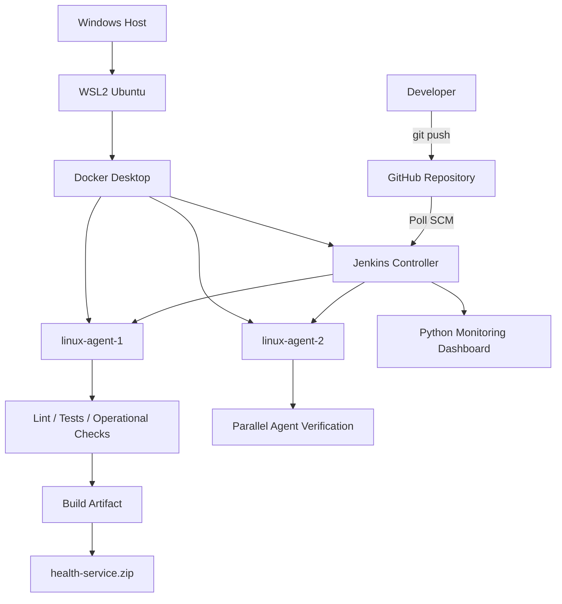

# Jenkins CI Reliability Lab

A hands-on CI infrastructure lab built to learn Jenkins administration, distributed builds, Linux and Docker troubleshooting, failure analysis, reliability engineering, monitoring, security, and CI operational practices.

The project runs Jenkins in Docker inside WSL2 and uses multiple containerized Jenkins agents to execute a Python CI pipeline.

## Project Goals

This project demonstrates practical experience with:

- Jenkins controller and agent architecture
- Declarative Jenkins pipelines
- Git-based CI automation
- Distributed and parallel builds
- Linux troubleshooting
- Docker networking and persistent storage
- Build queues and executor capacity
- CI failure classification
- Reliability mechanisms
- Operational monitoring
- Jenkins credentials and secret handling
- Python and shell automation

## Architecture



More details are available in [`docs/architecture.md`](docs/architecture.md).

## Technology Stack

- Jenkins
- Docker
- WSL2 / Ubuntu
- Git and GitHub
- Python
- Pytest
- Ruff
- Shell scripting
- Jenkins REST API
- Groovy / Declarative Pipeline

## Repository Structure

```text
.
├── app/
│   └── health.py
├── tests/
├── scripts/
│   ├── check_disk.sh
│   └── check_jenkins.py
├── monitoring/
│   └── dashboard.py
├── docker/
│   └── agent/
│       └── Dockerfile
├── docs/
├── Jenkinsfile
├── Jenkinsfile.capacity
├── requirements.txt
└── README.md
```

## Jenkins Architecture

The Jenkins controller runs in a Docker container named:

```text
jenkins-controller
```

Jenkins state is stored outside the container in the persistent Docker volume:

```text
jenkins_home
```

This allows the controller container to be recreated without losing Jenkins configuration.

Build execution is delegated to two inbound Docker agents:

```text
linux-agent-1
linux-agent-2
```

Each agent has:

- Python
- Git
- one Jenkins executor
- access to the `jenkins-lab` Docker network

The controller coordinates work while agents execute pipeline tasks.

## CI Trigger

The project uses Jenkins Poll SCM:

```text
H/2 * * * *
```

Jenkins periodically checks the GitHub repository for changes.

The basic CI flow is:

```text
Developer pushes code
        ↓
GitHub repository changes
        ↓
Jenkins detects SCM change
        ↓
Pipeline starts automatically
        ↓
Agents execute CI stages
```

## Pipeline Stages

The pipeline includes:

1. Verify Agents
2. Checkout
3. Environment Setup
4. Validate Environment
5. Credential Check
6. Operational Checks
7. Quality Checks
   - Lint
   - Tests
8. Build
9. Archive

Linting and testing can run in parallel.

The pipeline also supports parameters such as the target environment.

## Build Artifact

The application is packaged as:

```text
health-service.zip
```

The ZIP is generated during the build and archived by Jenkins.

Build artifacts are intentionally excluded from Git source control through `.gitignore`.

## Reliability Improvements

The pipeline includes several reliability controls:

- build timeout
- disabled concurrent executions of the same pipeline
- build and artifact retention limits
- retries for transient infrastructure checks
- health checks
- dependency version pinning
- explicit post-build status reporting
- failure classification
- multiple Jenkins agents
- persistent Jenkins storage

Retries are used for transient infrastructure operations rather than to hide failing product tests.

## CI Signal Quality

Failures are categorized to make CI results more actionable.

Examples:

```text
FAILURE_CLASS=PRODUCT
FAILURE_CLASS=INFRASTRUCTURE
FAILURE_CLASS=DEPENDENCY_OR_ENVIRONMENT
```

This helps distinguish application failures from Jenkins or environment problems.

The lab also tested flaky-test behavior and demonstrated why rerunning unreliable tests can reduce confidence in CI results.

## Resource and Capacity Testing

A separate capacity pipeline was used to study:

- executors
- build queues
- parallel jobs
- CPU
- RAM
- disk capacity
- agent capacity
- resource contention

Experiments compared:

```text
1 executor
multiple executors
multiple Jenkins agents
```

A key lesson was that executors are scheduling slots; increasing executor count does not create additional CPU or RAM.

## Monitoring

A Python monitoring component uses the Jenkins REST API to display operational information including:

- Jenkins availability
- online agents
- offline agents
- queue size
- recent builds
- failed builds
- average build duration
- disk usage

This provides lightweight operational visibility without introducing a full monitoring platform.

## Automation Tools

### Disk health check

`scripts/check_disk.sh` checks disk utilization and returns a non-zero exit code if usage exceeds a configured threshold.

### Jenkins health check

`scripts/check_jenkins.py` verifies that the Jenkins controller is reachable from the CI environment.

### Monitoring dashboard

`monitoring/dashboard.py` queries Jenkins through its REST API and summarizes system and build state.

## Security

Secrets are not stored in Git.

Security practices implemented in the lab include:

- `.env` and runtime secrets ignored by Git
- Jenkins Credential Store
- API token authentication
- temporary credential injection into pipelines
- secret rotation after exposure
- pinned Python dependencies
- separation of controller and build agents
- least-privilege thinking

Agent connection secrets and API tokens must never be committed to this repository.

## Troubleshooting Examples

Several failures were intentionally introduced and diagnosed:

- unit test regression
- offline Jenkins agent
- Jenkinsfile syntax error
- missing environment variable
- Python syntax error
- shell comparison error
- incorrect container networking assumptions
- Jenkins controller connectivity failure
- flaky test behavior
- queued builds caused by limited executor capacity

These experiments were used to practice distinguishing product failures from infrastructure failures.

See [`docs/troubleshooting.md`](docs/troubleshooting.md) and [`docs/incident-runbook.md`](docs/incident-runbook.md).

## Setup Overview

Requirements:

- Windows with WSL2
- Ubuntu
- Docker Desktop with WSL integration
- Git

Create the Jenkins network:

```bash
docker network create jenkins-lab
```

Create persistent controller storage:

```bash
docker volume create jenkins_home
```

Start the Jenkins controller:

```bash
docker run -d \
  --name jenkins-controller \
  --restart=on-failure \
  -p 8080:8080 \
  -p 50000:50000 \
  -v jenkins_home:/var/jenkins_home \
  jenkins/jenkins:lts-jdk21
```

The custom agent image is built from:

```text
docker/agent/Dockerfile
```

Agents connect to the controller over the `jenkins-lab` Docker network.

Secrets required when connecting inbound agents should be entered locally and must never be committed.

## Documentation

Additional documentation:

- [`architecture.md`](docs/architecture.md)
- [`jenkins-admin.md`](docs/jenkins-admin.md)
- [`troubleshooting.md`](docs/troubleshooting.md)
- [`incident-runbook.md`](docs/incident-runbook.md)
- [`pipeline-design.md`](docs/pipeline-design.md)
- [`lessons-learned.md`](docs/lessons-learned.md)

## Lessons Learned

The most important lessons from this project are:

- A Jenkins controller should coordinate work rather than perform normal builds.
- Agents provide execution capacity and isolation.
- Executors represent scheduling capacity, not physical resources.
- More executors can increase resource contention.
- CI failures should provide clear and trustworthy signals.
- Infrastructure failures and product failures require different troubleshooting paths.
- Retries should target transient failures, not hide unreliable tests.
- Docker container networking changes the meaning of `localhost`.
- Persistent storage allows disposable Jenkins containers.
- Monitoring is required to understand system state before failures become incidents.
- Secrets must be stored and injected securely rather than committed.
- Reliable CI requires operational engineering, not just a working Jenkinsfile.

## Project Status

The lab includes a complete Jenkins CI environment covering:

- controller deployment
- persistent storage
- distributed agents
- automated SCM builds
- CI pipeline execution
- artifacts
- failure triage
- reliability controls
- signal quality
- capacity testing
- monitoring
- security
- operational documentation